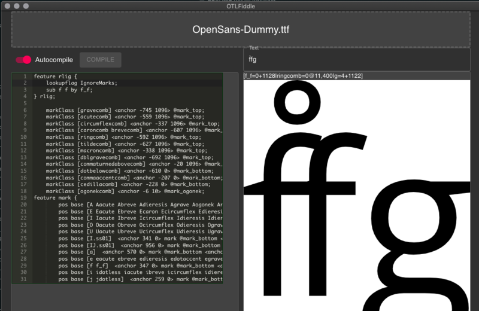

# OTLFiddle: Type feature code, get render view

OTLFiddle is like [JSFiddle](https://jsfiddle.net), but for fonts: it's a
playground for your OpenType feature code. Drag and drop a font at the top,
type in your feature code, and you can see the resulting font on the right
hand side.



OTLFiddle doesn't require a font editor, but it _does_ require you to have
the Python `fontTools` library installed. Try one of these commands if
you don't already have it:

```
% sudo pip install fontTools
% sudo easy_install fontTools
% sudo apt install fonttools-python
```

## Changes

### 1.1.0

- New feature editor
- Add zoom in and zoom out controls
- Manual compilation mode
- Detects Python 2 as well as Python 3

### 1.0.0 - Initial release
